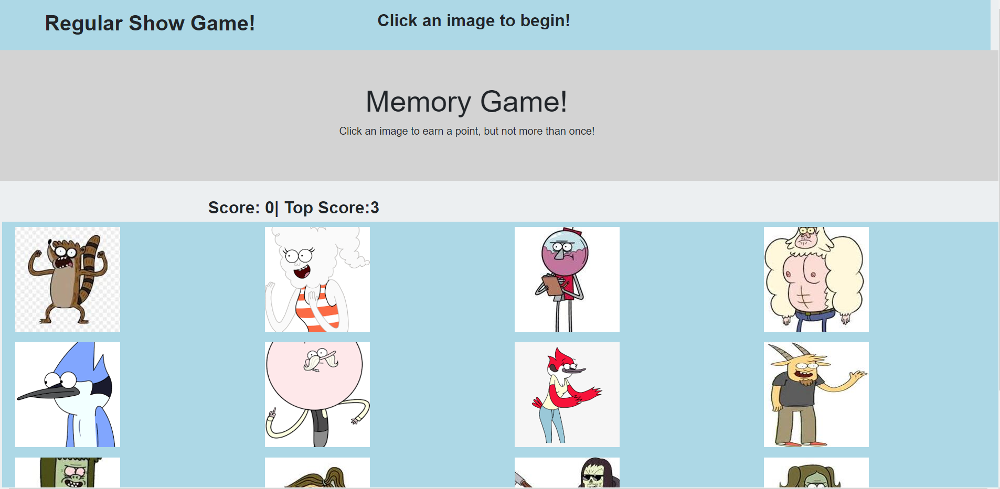

# Memory Game
In this application I used React to create a memoery game in which the user has to select an image to add a point to their score. The images then shuffle and the user continues to select until they select the same image twice in which then the user loses and a top scoer is given.
## Image of the APP

## Built With

* [React](https://www.react.com/)
* [Javascript](https://www.javascript.com/)
* [Node.js](https://nodejs.org/en/)
* [NPM](https://www.npmjs.com/)

## Deployed Site
- [Memory Game](https://gabrielpineda808.github.io/memory-game)
## Github Repository
- [Memory Game Repo](https://github.com/GabrielPineda808/memory-game)

## Authors

* **Gabriel Pineda** 

- [Link to Github](https://github.com/GabrielPineda808)
- [Link to LinkedIn](https://www.linkedin.com/in/gabriel-pineda-a94535195/)